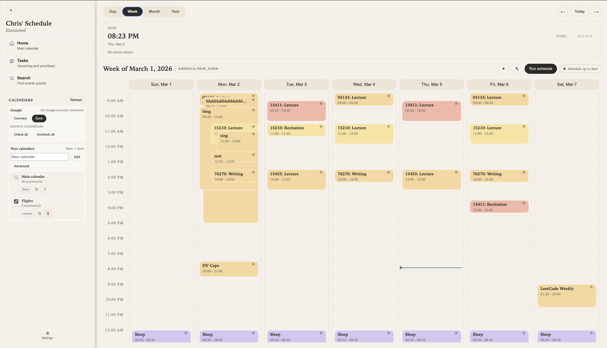

# Elastisched

Elastisched is an elastic scheduling system for time-constrained tasks and recurring events. It combines deterministic constraints with a C++ optimization engine, an API-first backend, and an interactive calendar UI.

## Highlights
- Flexible "blob"-based event model with schedulable windows and policy flags.
- Simulated-annealing scheduler with configurable cost weights and granularity.
- Recurrence system (`single`, `multiple`, `weekly`, `delta`, `date`).
- FastAPI backend with integrations and LLM-assisted scheduling flows.
- Vanilla JS frontend with day/week/month/year views and scheduling controls.

## Architecture
- `backend/`: FastAPI app, persistence, routing, integrations, and LLM runtime.
- `core/`: Python scheduling domain primitives (blob, timerange, recurrence).
- `engine/`: C++ scheduler + `pybind11` Python bindings.
- `frontend/`: Browser UI served at `/ui`.
- `learning/`: Preference-learning and embedding scaffolding.

## Repository Docs
Each major folder has its own README:

- [`backend/README.md`](backend/README.md)
- [`core/README.md`](core/README.md)
- [`docs/README.md`](docs/README.md)
- [`electron/README.md`](electron/README.md)
- [`engine/README.md`](engine/README.md)
- [`frontend/README.md`](frontend/README.md)
- [`landing/README.md`](landing/README.md)
- [`learning/README.md`](learning/README.md)
- [`mcp/README.md`](mcp/README.md)
- [`tests/README.md`](tests/README.md)
- [`bin/README.md`](bin/README.md)

## Quick Start
### Docker
1. `docker compose up --build`
2. Open the app at `http://localhost:8000/ui` (or the frontend proxy at `http://localhost:8080`).

### Local Development
1. `python3 -m venv .venv`
2. `source .venv/bin/activate`
3. `pip install -r requirements.txt`
4. `uvicorn backend.main:app --reload --host 0.0.0.0 --port 8000`
5. Open `http://localhost:8000/ui`

## Configuration
Common environment variables:
- `DATABASE_URL` (default: `sqlite+aiosqlite:///./core.db`)
- `ELASTISCHED_PROJECT_TZ` (default: `UTC`)
- `GEMINI_API_KEY`, `GEMINI_MODEL`
- `GOOGLE_OAUTH_CLIENT_ID`, `GOOGLE_OAUTH_CLIENT_SECRET`, `GOOGLE_OAUTH_REDIRECT_URI`, `GOOGLE_OAUTH_SCOPES`

## Testing
- Python tests: `pytest -q`
- C++ engine tests:
  1. `cmake -S engine -B engine/build_tests -DELASTISCHED_BUILD_TESTS=ON`
  2. `cmake --build engine/build_tests`
  3. `ctest --test-dir engine/build_tests --output-on-failure`

## License
MIT. See [`LICENSE`](LICENSE).
